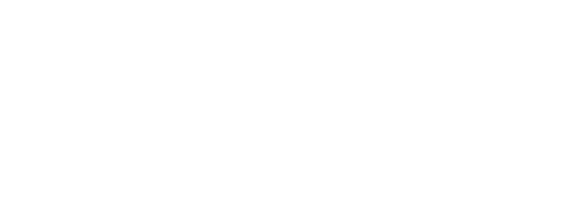

# Gasworks site — assets & copy checklist

Use this list as you migrate from **WileyWorx** to **Gasworks**. Files live in [`media/`](./media/). The homepage is a single scroll experience with labeled blocks in `index.html`.

## Hero — the Media Mill (3D scroll-driven palette)

The hero background is a **3D media mill**: a depth-staged grid of **14** video/gif tiles that the camera moves through as you scroll. Thematically it’s the Gasworks production line — each tile is a "press" stamping out a shot. The mill auto-pauses any video that scrolls off-screen, and degrades to a static collage when the visitor has `prefers-reduced-motion` enabled.

When sourcing new loops from your machine, use the main **`Gasworks Site Cursor/`** folder only — **not** `Gasworks Site Cursor/Extra/` (that directory is for alternates or duplicates and should not feed the live mill).

### Files to drop in

Place loops at `gasworks-site/media/mill/reel-01.mp4` … `reel-14.mp4`. Posters at `reel-01-poster.jpg` … `reel-14-poster.jpg`. GIFs work too — see [`media/mill/README.md`](./media/mill/README.md) for the full spec.

| Asset | Spec |
|---|---|
| Loop | 4–10 s, **no audio**, MP4 (H.264) preferred for Safari, **640×360 to 960×540** is plenty (the tile renders ~180–320 px wide). Keep file sizes < 600 KB each — there are 14 of them. |
| Poster | Same aspect (16:9), JPG/WebP, ~50 KB. Used as a fallback frame while the loop loads. |
| GIF alternative | Use only if the source is already a GIF; MP4 is ~10× smaller for the same quality. |

### Swapping a placeholder for real media

In `index.html` find the `<article class="media-mill__tile" data-tile="01" ...>` you want to fill, and replace its inner `.media-mill__media--placeholder` block:

**Before:**

```html
<div class="media-mill__media media-mill__media--placeholder">
  <span class="media-mill__serial">REEL · 01</span>
  <span class="media-mill__caption">media/mill/reel-01.mp4</span>
</div>
```

**After (video):**

```html
<div class="media-mill__media">
  <video autoplay muted loop playsinline preload="metadata"
         poster="media/mill/reel-01-poster.jpg">
    <source src="media/mill/reel-01.mp4" type="video/mp4" />
  </video>
</div>
```

**After (GIF):**

```html
<div class="media-mill__media">
  
</div>
```

`.media-mill__media` already has `overflow: hidden` and dark filter, so any landscape clip will sit cleanly in the tile.

### Tuning the mill

Each tile carries inline CSS variables on its `<article>`:

| Variable | Meaning |
|---|---|
| `--tx` | Horizontal offset from screen center (e.g. `-38vw` = far left) |
| `--ty` | Vertical offset from screen center (e.g. `-22vh` = above center) |
| `--tz` | Depth — more negative is further back. Range used: `-680` (deep) → `-120` (closest) |
| `--rot` | Z-axis rotation, in degrees, for a hand-laid feel |

Want a denser or sparser cloud? Add or remove `<article>` elements — no JS changes needed, scroll-driven motion picks up new tiles automatically.

### Default single-shot fallback (legacy)

If you ever want to revert to a single hero loop instead of the mill, the previous markup is left in a comment near the top of the hero in `index.html`. The old `media/hero-poster.jpg` + `media/hero-reel.mp4` filenames are still suggested.

## Client logos (3D revolving strip)

Logos sit on a **full-bleed thin strip** and rotate on a **cylinder** whose front arc spans the whole viewport. As a logo nears the screen edge it rotates past 90°, its **back face hides** (CSS `backface-visibility`), so it disappears “behind the page” and re-emerges on the opposite side as the ring comes back around.

The ring currently lists **16 unique brand positions** (`--n: 16`). Each is a labeled placeholder until you drop the official logo file in. The outer glow is applied via CSS (`drop-shadow`) on whatever `` lives inside the panel — you do **not** need to bake a glow into the file itself.

### Brand → file mapping

Place official **transparent‑background PNGs** (or SVGs) at the paths below. Match the slug exactly; the `data-brand` attribute on each panel already references it.

| # | Brand | Suggested filename | Sourcing note |
|---|-------|--------------------|---------------|
| 1 | Monster Energy | `media/clients/monster-energy.png` | Monster Energy press / sponsorship kit |
| 2 | University of Utah | `media/clients/utah.png` | umc.utah.edu brand toolbox (use the Block U or full wordmark) |
| 3 | Burton Snowboards | `media/clients/burton.png` | Burton press room |
| 4 | Oakley | `media/clients/oakley.png` | Oakley brand assets / press kit |
| 5 | O’Neill | `media/clients/oneill.png` | O’Neill press kit |
| 6 | ESPN | `media/clients/espn.png` | ESPN Press Room logo download |
| 7 | Live Nation | `media/clients/live-nation.png` | Live Nation press / partner page |
| 8 | US Ski Team | `media/clients/us-ski-team.png` | usskiandsnowboard.org partner kit |
| 9 | USA Nordic | `media/clients/usa-nordic.png` | usanordic.org media kit |
| 10 | Big 12 Conference | `media/clients/big-12.png` | Big 12 brand / partner assets |
| 11 | Snowbird | `media/clients/snowbird.png` | Snowbird media kit |
| 12 | Subaru | `media/clients/subaru.png` | Subaru newsroom / brand toolkit |
| 13 | Lincoln | `media/clients/lincoln.png` | Lincoln press site |
| 14 | Columbia | `media/clients/columbia.png` | Columbia Sportswear press portal |
| 15 | Advanced Gloves | `media/clients/advanced-gloves.png` | brand contact |
| 16 | Powder Mountain | `media/clients/powder-mountain.png` | powdermountain.com brand assets |

### File spec

| Spec | Value |
|---|---|
| Format | PNG with transparent background (SVG also fine) |
| Color | White/light or full color — both work; glow is white and additive |
| Height | Export at **~64–96 px tall** at 2x density (will render ~32 px in the strip) |
| Padding | Trim tight; the panel handles spacing |
| Don’t bake in glow | The CSS `drop-shadow` filter adds it — keep source files clean |

### Swapping a placeholder for the real logo

In `index.html`, change:

```html
<div class="logo-carousel__panel logo-carousel__panel--placeholder" data-brand="oakley">
  <span>Oakley</span>
</div>
```

to:

```html
<div class="logo-carousel__panel" data-brand="oakley">
  
</div>
```

(Remove the `--placeholder` modifier and the `<span>`; everything else stays.)

### Tuning the cylinder

On `.logo-carousel__ring`:

- `--n` — **must** equal the total number of `<li class="logo-carousel__face">`. Default `16`.
- `--radius` — cylinder size; default `clamp(420px, 54vw, 900px)` so the front arc still spans the viewport with 16 faces.
- `--face-w` / `--face-h` — panel dimensions; default `min(150px, 19vw)` / `48px`.

If you want a fuller ring (more density), duplicate the 16 `<li>` blocks for positions `--i: 16` … `--i: 31`, set each duplicate to `aria-hidden="true"`, and bump `--n` to `32`.

## Selected work (6 tiles)

For each project:

| Field | Notes |
|--------|--------|
| Still or loop | 1920×1080 (or 2560×1440) export; JPG/WebP or short MP4/GIF |
| Title | e.g. campaign or film name |
| Category line | e.g. `Commercial · Nike` |
| Link | Vimeo, YouTube, or case-study URL — set `href` and remove `work-tile--placeholder` |

Suggested files: `media/work-01.jpg` … `media/work-06.jpg`.

## Services / BTS image

| Asset | Spec |
|--------|------|
| BTS or studio shot | 1600×2000 (4:5) or 1200×1600 (3:4) | `media/services-still.jpg` |

## About portrait / space

| Asset | Spec |
|--------|------|
| Team or space | 1200×1600 (3:4) | `media/about-portrait.jpg` |

## Reel

- **Embed:** Paste a Vimeo/YouTube iframe inside `.reel-card` (replace the placeholder inner content), **or**
- **Self-hosted:** `<video controls poster="...">` with multiple `<source>` tags.

Keep key art in the poster image for slow connections.

## Copy to replace (search in `index.html`)

- **Hero headline & lede** — `hero__title`, `hero__lede`
- **Services list** — titles and descriptions under “What we do”
- **About** — two `prose` paragraphs + `facts` (location, email)
- **Footer** — email, phone, social URLs, mailing address
- **Meta** — `<title>` and `<meta name="description">` in `<head>`
- **Legal** — update or remove the WileyWorx line in the footer when you are ready

## Domain & launch

- Point **gasworks** domain to this folder (e.g. Vercel/Netlify static deploy) when DNS is ready.
- Replace every `gasworks.example` and placeholder phone with production values.

## Optional next pages (not scaffolded yet)

- `/work` — full case grid with filters
- `/directors` or `/roster` — if you sign talent
- `/contact` — form + Calendly

When you add pages, reuse `styles.css` and mirror the header/footer from `index.html`.
